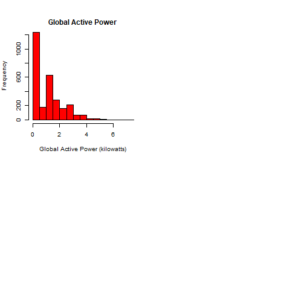

# Exploratory_data_analysis
https://github.com/jmballesteros123/Exploratory_data_analysis.git

![https://raw.githubusercontent.com/jmballesteros123/master/Exploratory_data_analysis/plot1.png]

plot1.png

